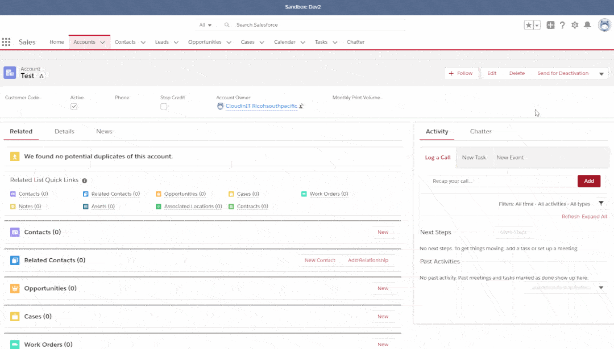

## FlagRecord

### Features
1. Flag Records Dynamically
Flag records dynamically through quick action and display flag message through lightning components on a page.
2. Add Custom Flag action and Message
Add custom flag action, just add new values on Type__c field on Flagged_Record__c object
3. Broadcast Message
Broadcast message on an object through record page without record-specific flagging
4. Reportable Flagged Records
Track flagged records through report

### Demo

### Deployment
1. Use ant to deploy package
2. put salesforce-ant.jar inside the root directory
3. run ant deploy

### OR

 

